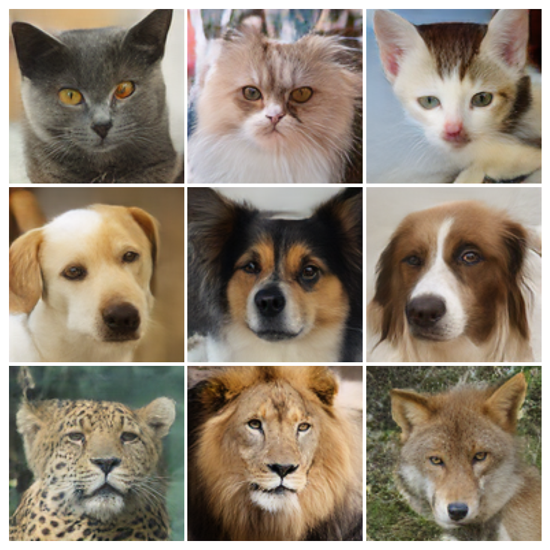
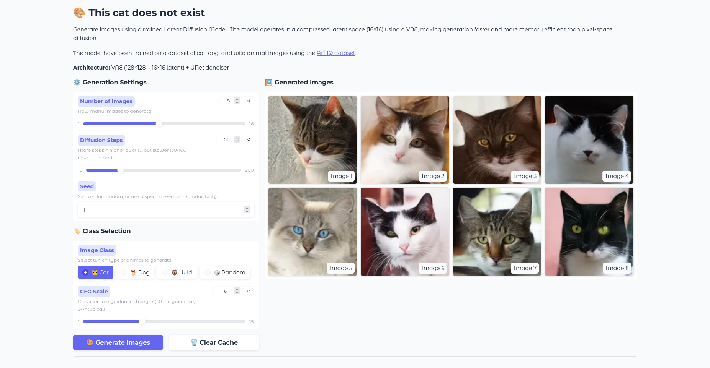

# diffusion-pytorch
This repository contains experimentation around diffusion models using PyTorch, including training, inference, and a browser-based web application.


*Sample images generated by the trained Latent Diffusion Model*

## 🌐 Live Demo

Try the web app: **[https://tchauffi.github.io/diffusion-pytorch/](https://tchauffi.github.io/diffusion-pytorch/)**

The web app runs entirely in your browser using ONNX Runtime WebAssembly - no server required!

## Setup
Make sure you have [Poetry](https://python-poetry.org/docs/) installed. Then, clone the repository and navigate into it:
```bash
git clone https://github.com/tchauffi/diffusion-pytorch.git
cd diffusion-pytorch
```

Use poetry to install dependencies:
```bash
poetry install
```

## Training
To train a diffusion model, run:
```bash
poetry run python train.py
```

## Generating Images using Gradio App



To generate images using a trained diffusion model, run the Gradio app:
```bash
poetry run python app_latent_diffusion.py
```

The app will be accessible at `http://localhost:7860`. You can specify the number of images to generate, the number of diffusion steps, and the path to the trained model checkpoint.

## Model Evaluation

### FID Scores

The latent diffusion model was evaluated using the Fréchet Inception Distance (FID) metric on the AFHQ dataset:

| Class | FID Score |
|-------|-----------|
| Cat   | 40.97 ± 0.67 |
| Dog   | 69.74 ± 1.95 |
| Wild  | 40.71 ± 1.21 |
| **Overall** | **33.90 ± 0.61** |

**Evaluation Settings:**
- 500 generated samples per class
- 500 real samples per class
- 50 DDIM sampling steps
- Classifier-free guidance scale: 3.0
- 5 evaluation runs with different random seeds

To reproduce the evaluation:
```bash
poetry run python scripts/evaluate_fid.py --samples_per_class 500 --num_steps 50 --num_runs 5
```

## Web Application

The project includes a browser-based image generation app built with Next.js and ONNX Runtime WebAssembly.

### Features
- 🖥️ Runs entirely in the browser (no backend required)
- ⚡ WebAssembly-powered inference using ONNX Runtime
- 🎨 Latent Diffusion Model for image generation
- 📱 Responsive design with Tailwind CSS

### Local Development

```bash
cd webapp/frontend
npm install --legacy-peer-deps
npm run dev
```

Then open [http://localhost:3000](http://localhost:3000).

### Tech Stack
- **Frontend**: Next.js 14 with TypeScript
- **Inference**: ONNX Runtime Web (WebAssembly)
- **Styling**: Tailwind CSS
- **Hosting**: GitHub Pages (static export)

See [webapp/README.md](webapp/README.md) for more details.

## Project Structure

```
├── diffusers/              # PyTorch model implementations
│   ├── basic_model/        # Basic diffusion model
│   ├── latent_diffusion/   # Latent diffusion model
│   └── vae/                # Variational autoencoder
├── webapp/                 # Browser-based web application
│   └── frontend/           # Next.js frontend
├── export_onnx.py          # Export models to ONNX format
├── app_latent_diffusion.py # Gradio inference app
└── train.py                # Training script
```

